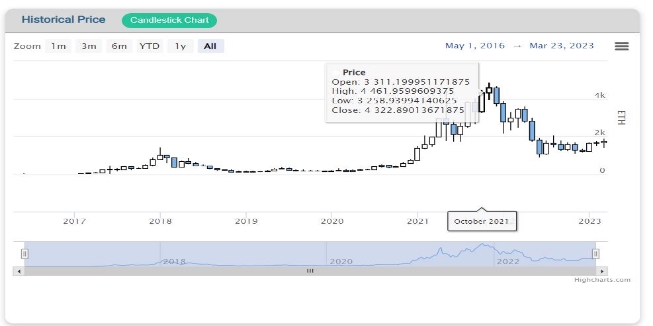

#  CryptoSphere

### **Table of Contents**

* [Executive Summary](#_page2_x43.20_y50.55)
* [Technologies Used](#_page2_x43.20_y533.28)
* [UI Mockup using Figma](#_page2_x43.20_y533.123)
* [Requirements](#_page3_x43.20_y352.05)
* [Features In Detail](#_page3_x43.20_y550.41)
* [Overview Page](#_page4_x43.20_y50.55)
* [Charts Page](#_page6_x43.20_y270.67)
* [Event Page](#_page8_x43.20_y414.02)
* [News Page](#_page9_x43.20_y50.55)
* [Search Box](#_page9_x43.20_y461.79)
* [Backend](#_page10_x43.20_y50.55)
* [Server](#_page10_x43.20_y214.52)
* [Design and Architecture](#_page11_x43.20_y50.55)
* [Web Application Architecture](#_page11_x43.20_y103.44)
* [ER-Diagram](#_page11_x43.20_y438.38)
* [More Details](#_page12_x43.20_y50.55)
* [Future Scope](#_page12_x43.20_y391.76)
* [References](#_page12_x43.20_y521.35)

### **Executive Summary**

Cryptosphere is a coin screener website with crypto currencies that provides users with a comprehensive tool for analyzing and comparing cryptocurrencies, and for making informed decisions based on real-time and historical data.

The target users for this product ranges from crypto investors, crypto traders, crypto enthusiasts to researchers. They can make use of Cryptosphere to track price movements, trading volumes, news and other relevant statistics to make informed investment decisions, identify potential trading opportunities, learn about various cryptocurrencies and to conduct research and analysis. We aim to provide a one stop destination to get all data related to cryptocurrencies.

We currently support the following features:

1. **Ethereum** is supported in the first phase.
1. Various price statistics like live price of the coin, previous day price, market capital, volume weighted average price (VWAP), volume traded, NVT ratio.
1. Real time and historic charts that are updated live. Nine highly comprehensive charts including candlestick and line chart of historical price, intraday price, VWAP, volume and market cap are shown. These charts can be zoomed and downloaded in various formats including excel sheets.
1. Return of Investment (ROI) of Bitcoin, SPX index and Gold with respect to the cryptocurrency. These are shown for one day, week, month and six months.
1. News related to the selected cryptocoin. Links to the headlines are also provided if the user wishes to read more.
1. Event section that shows major events and updates that have happened related to the coin.
1. Search box with auto suggestion to search for various coins.

### **Technologies Used**

There is a frontend made of React.js that fetches data from the server endpoints and other APIs to display the data in the form of Charts, tables, news headlines etc.

Server is made with Node.js that forms endpoints. Data is fetched from the database and displayed. MySQL database is used to store the data. The database is hosted on Microsoft Azure which makes it possible for developers to work on it and access it remotely.

Data is inserted into the database using Python backend. Python scripts fetch the relevant data from different APIs and update the database. Cron and anacron are used to execute the Python scripts periodically.

The project can be further expanded to support various other coins. It will serve as a single destination for users looking to gain information regarding cryptocurrencies and make market based decisions.

### **UI Mockup using Figma**

Before we started off with building the project, we decided to create a mockup of the website on FIGMA. This was indeed very beneficial at each step because we knew the final product towards which we were heading. While doing the frontend we found it easy to code several visual specifications of the components and placing them in the website.

Figma link: [https://www.figma.com/file/Sj8FTtUP4iUUYpnBTWSiRr/Cryptosphere?node-id=0-1&t=TK1nM3V EZx3aja0E-0](https://www.figma.com/file/Sj8FTtUP4iUUYpnBTWSiRr/Cryptosphere?node-id=0-1&t=TK1nM3VEZx3aja0E-0)

It could be very well seen that our present website looks very similar to the UI we created.

### **Requirements**

The Cryptosphere website contains various data metrics related to cryptocurrencies like the intraday and historical prices, volume related data, VWAP, NVT ratio, ROI of the coin with respect to Bitcoin, SPX index and Gold, area and candlestick charts that helps analyze and study the data, relevant news related to the cryptocurrency and major events that have happened related to the coin.

The website helps crypto investors, traders, enthusiasts and researchers who wants to research and analyze the performance of various cryptocurrencies to make informed investment decisions, track the price movements and trading volumes, identify potential trading opportunities, stay up-to-date on the latest developments in the crypto industry and to learn more about cryptocurrencies.

### **Features In Detail**

The major features of the Cryptosphere website are spread across four pages of the application namely, Overview, Charts, Events and News pages. A detailed description about each page is given below:

1. **Overview Page:**

- This contains the price statistic details like Intraday price, daily price, market cap, Volume weighted average price, volume and NVT ratio.

The data for Ethereum (ETH) is obtained from the Coin Metrics API.

- Return of Investment (ROI) of Gold, SPX index and Bitcoin (BTC) with respect to Ethereum are shown for one day, week and month. The data for the price of Bitcoin is obtained from the Coin Metrics API and the data for the prices of gold and SPX Index is obtained from the Twelve Data API.

The ROI of ETH has been calculated against Bitcoin, SPX Index and Gold in percentage on daily, weekly and monthly basis. Since the data involves null values (for days on which data is unavailable), for daily, the first previous non null values, for weekly, the first seven non null values and for monthly, the first thirty non null values have been taken for calculations. The formula:

Here, V stands for the value of BTC, SPX Index or Gold depending on the entity against which the ROI is being calculated. c implies current value. p implies the previous value depending upon whether the calculation is being done for 1 day, 1 week or 1 month.

- A historic time series price chart of the coin that gives the closing price of the coin v/s time. This gets automatically updated. The chart shows the closing price of the coin if you hover over a point in the line. It also has options to zoom.

- An About section that provides an overview of the cryptocurrency. The user is redirected to further resources if they wish to read more about it.

2. **Charts page:**

This contains nine charts that helps in a better analysis of the cryptocurrency

- Historical Price Chart : Candlestick and Area chart. It provides the value of Open, High, Low and Close price of the coin. We have the data from 2016 - present.
- Intraday Price Chart : Candlestick and Area chart.
- Historical Volume Weighted Average Price (VWAP) Chart
- Intraday Volume Weighted Average Price (VWAP) Chart
- Historical Volume Chart
- Intraday Volume Chart
- Market Cap Chart

The charts show loading spinners before the charts are loaded. This gives a seamless user experience.

On hovering over each candlestick, you can get the open, high, low and close price of the coin. There is an option to zoom and view.

Charts also have a toggle menu that gives various options of downloading the chart and viewing it in full screen mode. Downloading the chart in excel format helps in further analysis of the data.

The charts are plotted using the **Highchart library** of React.js.

3. **Events page:** These show major events and updates that have happened related to the coin. It contains all the important timelines that happened in the advancement of Ethereum. The USD ETH

price, block numbers and epoch numbers are also displayed if they are linked with the event. Recent advancements can be appended in the list if they make a breakthrough in the ETH world.

4. **News page**: Displays news articles relevant to the specific coin. Link to the full article is also specified. This helps the user get updated regarding events that might affect the specified coin

market.

NewsAPI has been used for fetching the news in real-time. It has been ensured that only Ethereum related news is fetched (similarly can be implemented for each coin), such that top 5 latest news headlines are shown to the user. Each news tile has the headline, a glimpse of the description which can be read in detail clicking on the link. It also has the source and the time of publication. Additionally, care has been taken that all the headlines are unique using a set.

5. **Search box** with auto suggestion to search various coins.

Redux has been used for the implementation of this feature. The Redux toolkit has been used to simplify the integration of Redux with React. Upon clicking any suggestion, the user is taken to a dedicated route which displays the name of the coin. Additionally, if ethereum is clicked the user is taken to the overview page.

### **Backend**

Python is used to update the tables in the MySQL database. Python scripts scrape the required data from the Coin Metrics and Twelve Data APIs using the Requests library. This data is then inserted into the MySQL database using the MySQL Connector/Python driver. The data includes intraday time series data (with intervals of one minute) as well as end-of-day time series data (with intervals of one day). The Python script which updates the intraday data in the database is scheduled to run once every thirty minutes using cron. The scripts which update the end-of-day data in the database are scheduled to run once daily using anacron.

### **Server**

Node.js and Express framework is used to create the server and endpoints. Server is linked to the database using the mysql2 package from npm. Data is fetched from the database and displayed on the endpoints created. In the development mode, <http://localhost:5000/eod-data> displays the data from the eod\_data table in json format, <http://localhost:5000/intraday-prices> displays the data from intraday\_prices table and <http://localhost:5000/other-securities> displays the data from other\_securities table.

### **Design and Architecture**

 

**Web Application Architecture**
 

 

**ER-Diagram - cryptodb**

### **More Details**
<!-- 

 -->

  
  

  

 

### **Future Scope**
- Can support more coins like Tether (USDT), USD Coin (USDC).
- More metrics can be supported like the Sharpe ratio.
- Add user login. They can follow specific coins of their choosing and get notifications regarding activities concerning these coins.
- Increase accessibility features and make it more user friendly.

### **References**

1. <https://www.highcharts.com/blog/posts/frameworks/react/>
1. <https://expressjs.com/>
1. <https://nodejs.org/en>
1. <https://azure.microsoft.com/en-in>
1. <https://newsapi.org/>
1. <https://coinmetrics.io/api-v4/>
1. <https://twelvedata.com/>
